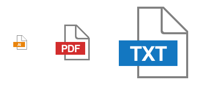

# File Icons
```bash
npm install @drawbotics/file-icons
```
A simple library to display icons depending on the file type. The library can be used both by importing the stylesheet (useful if you have a simple project without React dependencies), and also exports a React component.

**DISCLAIMER**
In order to have a _single div_ usage, and given the complexity of the icon look, a lot of CSS features that may not be compatible with older browsers is used. Namely `linear-gradient`, `border-image` and `clip-path`. Nonetheless, all the styles are prefixed.

## Usage
There are two ways to use the icons: with a simple `div` or with a React component. Either way, you should include the stylesheet to have the icons style:
```
@import '~@drawbotics/file-icons/dist/style.css';
```

#### Pure CSS
You can use `file-icons` just by importing the css styling and using a `div` as a base element. Add the class `file-icon` to your div and set the file type as a data attribute `data-file`:
```html
<div className="file-icon" data-file="docx" />
```
**Note**: The file extension needs to be in lower case.

You can also pass different class names for different sizes:
```html
<div className="file-icon file-icon--medium" data-file="3ds" />
<div className="file-icon file-icon--large" data-file="rar" />
```



Example icons with default, medium and large sizing.

#### React
You can import the component anywhere in your code through:
```js
import { FileIcon } from '@drawbotics/file-icons';
```
If you use CSSinJS then don't forget to include the stylesheet if you haven't already
```js
import '@drawbotics/file-icons/dist/style.css';
```

And use it like such:
```js
<FileIcon file="pdf" />
```

Here are the different options you can pass:

Prop | Type | Description | Possible values
--- | --- | --- | ---
`file` | String | File extension without the dot | `.doc`
`size` | String | To toggle between the 3 sizes | `medium`, `large`
`filename` | String | If you don't want to extract the extension yourself you can pass the filename directly | `my-document.pdf`

When using the React component you don't need to worry if the extension/filename is lowercase, the component takes care of that.

## Develop
```bash
npm install
```
To run examples
```bash
npm run build:watch     # for build step
npm run example         # to serve examples
```

To build for production
```bash
npm run build
```


## License
MIT. See [LICENSE](LICENSE) for details.
